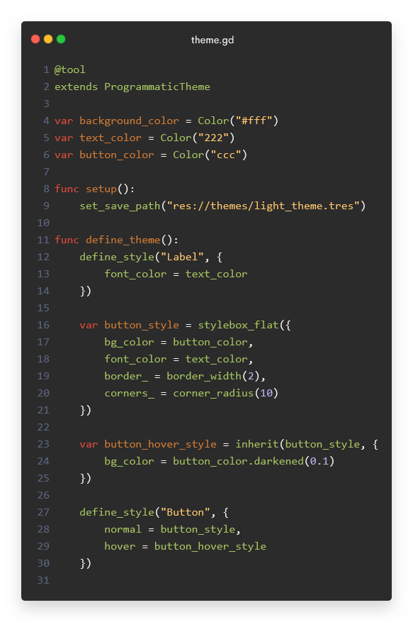
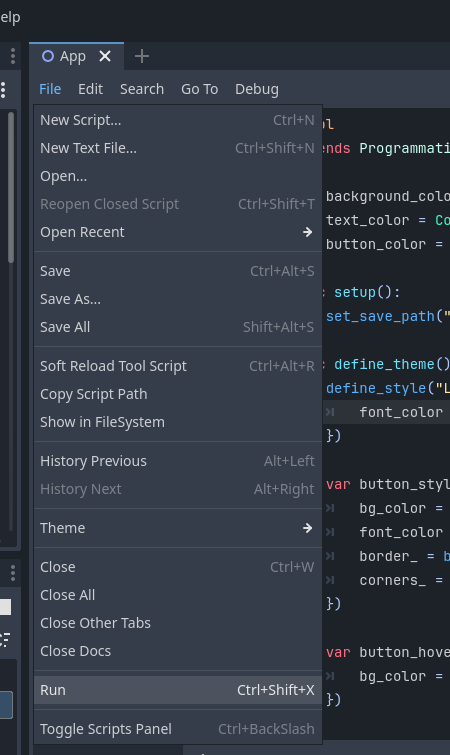

# ThemeGen

    

ThemeGen is a tool for Godot that allows you to easily create themes using GDScript code. The advantage over the UI theme editor is that you can reuse styles, recombine them, and effortlessly reuse and share colours between components.

It can also help you to use semantic colours, and to create multiple theme variations, e.g. a dark theme and a light theme.


## Setup

1. Go to the [Releases](https://github.com/Inspiaaa/ThemeGen/releases) page and download the latest version of this library.
2. Unzip the files and copy them anywhere into your Godot project.

## Getting Started

### Anatomy of a Basic Theme

In ThemeGen, you create scripts to generate themes. To get started, create a new GDScript file which extends the `ProgrammaticTheme` class, and mark it as `@tool` so that it can be run in the editor:

```gdscript
@tool
extends ProgrammaticTheme

func setup():
	set_save_path("res://themes/generated/light_theme.tres")

func define_theme():
	pass
```

There are two main methods to define:
1. `setup` is where you set the output path of the theme generator and where you can initialise variables used in your theme, e.g. primary colour, background colour, ... As you want to avoid editing the output file by accident, it's recommended to put it in a special folder to indicate that it is auto-generated and is likely to be overwritten (`generated` in this example).
2. In `define_theme` you call special methods that are inherited from the `ProgrammaticTheme` class to add styles to the theme.

To run the theme generator, click on `File/Run` (or use `Ctrl+Shift+X`) while editing the script. In the `Output` tab, you'll see the status of the generator and any errors that occur during execution.



Example output for the current file:

```
===
[ThemeGen] Discovered 1 theme(s).
--- EditorScript(light_theme.gd)::setup ---
[ThemeGen] Setting up theme generation.... (EditorScript(light_theme.gd)::setup)
[ThemeGen] Generating theme... (EditorScript(light_theme.gd)::define_theme)
[ThemeGen] Loading default font...
[ThemeGen] Loading variants...
[ThemeGen] Loading styles...
[ThemeGen] Saving to 'res://themes/generated/light_theme.tres'...
[ThemeGen] Theme generation finished.
---
===
```

Sometimes the Godot editor does not update directly when regenerating the theme. Setting the `Theme` property of the root control node again or reloading the editor fixes this issue.

### Setting the Default Font

```gdscript
func define_theme():
	define_default_font(ResourceLoader.load("res://themes/fonts/roboto.ttf"))
	define_default_font_size(16)
```

This can also be omitted if you want to use the defaults of the `Theme` class.

As we'll keep adding more and more calls like this to the `define_theme` method, may want to reuse some of the properties (e.g. the font size), and want to see all configurable / customisable properties in one place, it makes sense to put these currently hardcoded values into variables:

```gdscript
@tool
extends ProgrammaticTheme

var default_font = "res://themes/fonts/roboto.ttf"
var default_font_size = 16

func setup():
	set_save_path("res://themes/generated/light_theme.tres")

func define_theme():
	define_default_font(ResourceLoader.load(default_font))
	define_default_font_size(default_font_size)
```

### Styling Components

To configure the style of a node (e.g. Button, Label, ...) you can call the `define_style` method which takes as parameters:
- the name of the node to be styled,
- a dictionary with the properties to set.
Note that the name is case-sensitive. To find out which properties you can customise, see the *Theme Properties* section in the official documentation of the node (e.g. https://docs.godotengine.org/en/stable/classes/class_button.html) or use the inspector in the visual theme editor.

```gdscript
# ...

var text_font_color = Color.BLACK

# setup() ...

func define_theme():
	# ...
	define_style("Label", {
		font_color = text_font_color,
		line_spacing = default_font_size / 4
	})
```

When running the generator, the output now informs you about the style which it successfully added to the theme:

```
===
[ThemeGen] Discovered 1 theme(s).
--- EditorScript(light_theme.gd)::setup ---
[ThemeGen] Setting up theme generation.... (EditorScript(light_theme.gd)::setup)
[ThemeGen] Generating theme... (EditorScript(light_theme.gd)::define_theme)
[ThemeGen] Loading default font...
[ThemeGen] Loading variants...
[ThemeGen] Loading styles...
[ThemeGen] > Style 'Label':
[ThemeGen]   > Preprocessing...
[ThemeGen]   > Loading...
[ThemeGen] Saving to 'res://themes/generated/light_theme.tres'...
[ThemeGen] Theme generation finished.
---
===
```

Internally, the theme generator automatically detects the required data type for adding each property, which greatly reduces the amount of boilerplate code needed to programmatically define a theme in Godot.

While constants, colours, fonts, font sizes, and icons can be used directly when configuring properties, ThemeGen introduces special handling for StyleBoxes to make your life easier.

### Using StyleBoxes

To create a StyleBox in ThemeGen, you can use one of the following methods:
- `stylebox_flat(...)`
- `stylebox_line(...)`
- `stylebox_empty(...)`

These methods return special dictionaries which allow you to later combine style boxes together, inherit from them, and configure repetitive properties concisely.
As their argument these methods expect a dictionary which contains the properties to set on the actual `StyleBoxFlat` / ... instances which are ultimately created.

```gdscript
var background_color = Color.WHITE

func define_theme():
	# ...
	define_style("PanelContainer", {
		panel = stylebox_flat({
			bg_color = background_color
		})
	})
```

To inherit from a StyleBox, you can use the `inherit` method:

```gdscript
var button_color = Color.WHITE
var button_hover_color = button_color.darkened(0.05)
var button_pressed_color = button_color.darkened(0.1)
var button_border_color = Color("#aaa")
var default_border_width = 1

func define_theme():
	# ...
	var button_style = stylebox_flat({
		bg_color = button_color,

		border_color = button_border_color,

		border_width_left = default_border_width,
		border_width_top = default_border_width,
		border_width_right = default_border_width,
		border_width_bottom = default_border_width
	})

	var button_hover_style = inherit(button_style, {
		bg_color = button_hover_color
	})

	var button_pressed_style = inherit(button_style, {
		bg_color = button_pressed_color
	})

	define_style("Button", {
		normal = button_style,
		hover = button_hover_style,
		pressed = button_pressed_style
	})
```

Note that you can also inherit from multiple different StyleBoxes, e.g. 

```gdscript
var result = inherit(a, b, c, d)
```

There is also the `merge` method which essentially does the same, but can show your intent more clearly in some cases, similarly to how there exist semantic tags in HTML.

```
var result = merge(a, b, c, d)
```

If multiple StyleBoxes that are passed in contain the same properties, then the resulting StyleBox will use the ones that are passed in last, e.g. `d` overwrites duplicate keys from `c`.

Example usage:

```gdscript
var focus_color = Color.CYAN
var focus_border_width = 2

func define_theme():
	# ...
	var general_hover_style = stylebox_flat({
		draw_center = false,
		border_color = focus_color,

		border_width_left = focus_border_width,
		border_width_top = focus_border_width,
		border_width_right = focus_border_width,
		border_width_bottom = focus_border_width
	})

	var button_focus_style = merge(general_hover_style, button_style)
	
	define_style("Button", {
		normal = button_style,
		hover = button_hover_style,
		pressed = button_pressed_style,
		focus = button_focus_style
	})
```

### Shortcuts for Repetitive Properties

As always having to write out the property names for all border sides (see examples above), the corner radii, expand margins, and content margins is tedious, this tool provides a special mechanism to avoid this boilerplate:

```gdscript
var button_style = stylebox_flat({
	bg_color = button_color,
	border_color = button_border_color,
	
	border_ = border_width(default_border_width)
})
```

By adding an underscore `_` suffix to a key that refers to a sub-dictionary, the sub-dictionary is merged into the parent dictionary. This is performed in the `Preprocessing` phase that you may have noticed in the output log of ThemeGen. If you are familiar with Python, this is essentially the same as Python's dictionary merging syntax `{ k1: v1, k2: v2, **other_dictionary }`.

The `border_width` method being called is one of the special methods inherited from `ThemeGen` that automatically generates the following dictionary structure for you:

```
{
	border_width_left = ...,
	border_width_top = ...,
	border_width_right = ...,
	border_width_bottom = ...
}
```

Thus, after preprocessing, the final dictionary will look like this:

```gdscript
var button_style = stylebox_flat({
	bg_color = button_color,
	border_color = button_border_color,
	
	border_width_left = default_border_width,
	border_width_top = default_border_width,
	border_width_right = default_border_width,
	border_width_bottom = default_border_width
})
```

As you can see, the `border_` field has been replaced by the dictionary key-value pairs of the sub-dictionary it points to. This also means that the exact name given to the key does not matter, as long as it ends with `_`.

The `border_width()` method also allows you to specify the exact widths for each side: `border_width(left, top, right, bottom)`.

Besides this method, there are also the following shortcut methods for repetitive properties:
- `corner_radius(...)`
- `expand_margins(...)`
- `content_margins(...)`

### Creating Custom Style Variations

The Godot theming system also allows you to create multiple styles for the same node, by defining *variations*. Variations can inherit from the base style of a node or from another variation (https://docs.godotengine.org/en/stable/tutorials/ui/gui_theme_type_variations.html).
To create one in code, use the `define_style_variant(name, base_name, style)` method. 

```gdscript
var title_font_size = 20

func define_theme():
	# ...
	define_variant_style("Title", "Label", {
		font_size = title_font_size
	})
```

As this feature is implemented in the Godot engine, StyleBoxes are handled differently than in this tool. When you override a StyleBox property on a variant (e.g. `pressed` for Button), then it will not inherit from the StyleBox of the parent type, similarly to how `inherit(...)` would, and instead only uses the properties defined explicitly for this StyleBox. 

To avoid this, you can either...
- ... store the parent StyleBox in a variable and then manually call `inherit` when defining the variant's theme.
- ... use the built-in `styles` variable to reference the style property of the base node.

```gdscript
func define_theme():
	# ...
	var button_style = stylebox_flat(...)
	# ...
	
	var action_button_style = {
		font_color = Color.RED
	}

	define_variant_style("ActionButton", "Button", {
		normal = inherit(button_style, action_button_style)
		# ...
	})

	# OR

	define_variant_style("ActionButton", "Button", {
		normal = inherit(styles.Button.normal)
		# ...
	})
```

## Creating Theme Variants

Imagine that you're working on an app and you want to create a light theme and a dark theme. Most of the code required to define these themes is the same (e.g. which styles to define, which variations to create, corner radius for StyleBoxes, content margins, font sizes ...) and only the colours differ.

In ThemeGen, there is an easy way to create these theme variants: Simply create multiple setup functions. Each setup function represents a different them variation, and lets you set up attribute values that differ for the variant, e.g. colour values. The system works by looking for all user-defined methods that begin with the prefix `setup`.

Regarding the flow of execution, the system first looks for all setup functions. For each one, it then runs the setup method and then the `define_theme()` method. Thus, `define_theme` is shared between the theme variants, unless other behaviour is explicitly specified.

Example:

```gdscript
@tool
extends ProgrammaticTheme

var default_font_size = 16

var background_color
var text_color

func setup_light_theme():
	set_save_path("res://themes/generated/light_theme.tres")

	background_color = Color.WHITE
	text_color = Color.BLACK

func setup_dark_theme():
	set_save_path("res://themes/generated/dark_theme.tres")

	background_color = Color.BLACK
	text_color = Color.WHITE

func define_theme():
	define_default_font_size(default_font_size)

	define_style("PanelContainer", {
		panel = stylebox_flat({
			bg_color = background_color
		})
	})

	define_style("Label", {
		font_color = text_color
	})
```

Don't forget to call `set_save_path` in each setup function.

Running this produces the following output:

```
===
[ThemeGen] Discovered 2 theme(s).
--- EditorScript(my_theme.gd)::setup_light_theme ---
[ThemeGen] Setting up theme generation.... (EditorScript(my_theme.gd)::setup_light_theme)
[ThemeGen] Generating theme... (EditorScript(my_theme.gd)::define_theme)
[ThemeGen] Loading default font...
[ThemeGen] Loading variants...
[ThemeGen] Loading styles...
[ThemeGen] > Style 'PanelContainer':
[ThemeGen]   > Preprocessing...
[ThemeGen]   > Loading...
[ThemeGen] > Style 'Label':
[ThemeGen]   > Preprocessing...
[ThemeGen]   > Loading...
[ThemeGen] Saving to 'res://themes/generated/light_theme.tres'...
[ThemeGen] Theme generation finished.
---
--- EditorScript(my_theme.gd)::setup_dark_theme ---
[ThemeGen] Setting up theme generation.... (EditorScript(my_theme.gd)::setup_dark_theme)
[ThemeGen] Generating theme... (EditorScript(my_theme.gd)::define_theme)
[ThemeGen] Loading default font...
[ThemeGen] Loading variants...
[ThemeGen] Loading styles...
[ThemeGen] > Style 'PanelContainer':
[ThemeGen]   > Preprocessing...
[ThemeGen]   > Loading...
[ThemeGen] > Style 'Label':
[ThemeGen]   > Preprocessing...
[ThemeGen]   > Loading...
[ThemeGen] Saving to 'res://themes/generated/dark_theme.tres'...
[ThemeGen] Theme generation finished.
---
===
```

As you can see, ThemeGen informs you that it has found both setup functions and shows you the output of each one, which can be useful when debugging.

### Overriding `define_theme()`

If you have multiple theme variants that should not all use the same `define_theme()` method, you can explicitly set which function it should use instead in the setup function:

Example:

```gdscript
func setup_light_theme():
	set_save_path("res://themes/generated/light_theme.tres")
	# ...
	# This theme variant will use 'define_theme()' by default.

func setup_dark_theme():
	set_save_path("res://themes/generated/dark_theme.tres")
	# ...
	# This theme variant will use 'define_theme()' by default.

func setup_custom_theme():
	set_save_path("res://themes/generated/custom_theme.tres")
	# Use 'define_custom_theme.' instead of 'define_theme()'.
	set_theme_generator(define_custom_theme)

func define_theme():
	# ....

func define_custom_theme():
	# ...
```